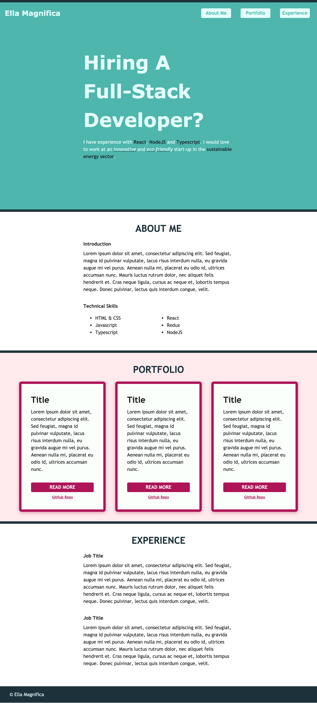

# Full Stack Portfolio

Today we are building a portfolio site for ourselves.
These types of sites use links to help visitors navigate the site. Your final site should look similar in layout to below:

## Instructions

- Create all the sections you see in the example image
- Create anchor links to navigate to different sections of the page - i.e. `About Me`, `Portfolio` and `Experience` links in the header should all take the user to different sections on the same page
- Create internal links to simple portfolio pages
- Create external links to GitHub and/or CodeSandbox
- Focus on building a website with navigation first; styling second

## Tips

- Remember you don't have to always use grid to create layouts. Use the default page flow to your advantage
- Use grid to get the right layout in the header
- Use `scroll-behaviour: smooth` for a better user experience

## Challenge 1

- Make the website responsive

Hiring A
Full-Stack
Developer?

I have experience with React,NodeJS and Typescript,I would love  
to work at an innovative and eco-friendly start-up in the sustainable  
energy sector.
